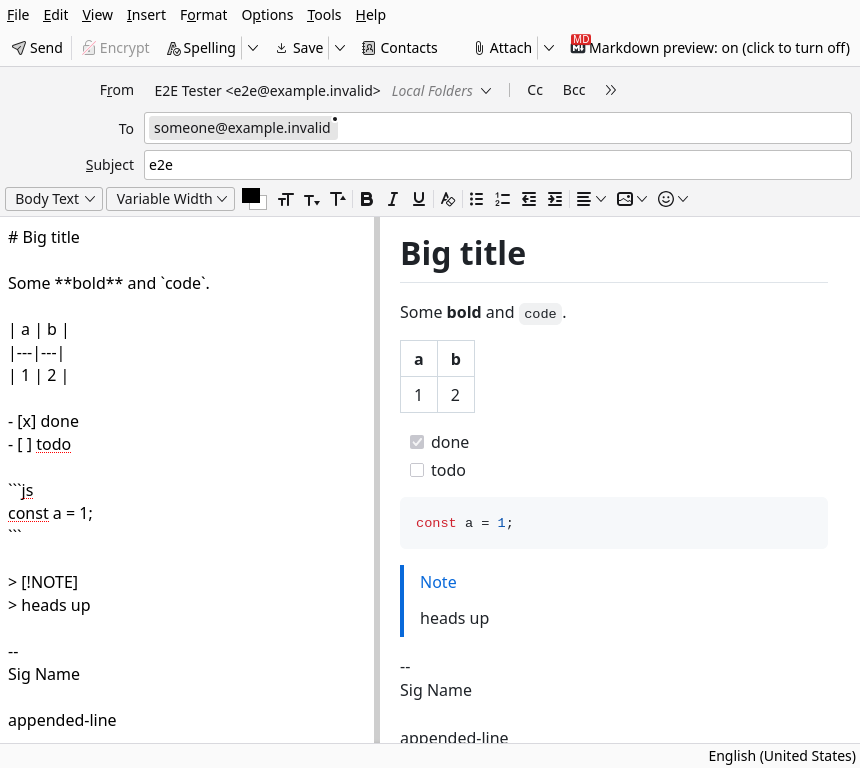

# Markdown Compose Preview for Thunderbird

[](https://github.com/sahiljhawar/thunderbird-markdown-preview/actions/workflows/ci.yml)
[](LICENSE)

Write Markdown in the Thunderbird compose window, see a live GitHub-style preview in a pane on
the right, and send the rendered result as a normal HTML email.



* Renders GitHub-flavoured Markdown: tables, task lists, strikethrough, autolinks, footnotes,
  `:emoji:` shortcodes, `> [!NOTE]` alerts and syntax-highlighted code fences.
* Everything is rendered **locally**. Nothing you write leaves your machine and the add-on has
  no network access.
* On Send, the GitHub styling is inlined into the HTML, so the message looks the same in Gmail,
  Outlook and other clients. Thunderbird adds the plain-text alternative as usual.
* Your signature is left alone: it is kept as the HTML Thunderbird inserted (bold, links and
  images intact) and never goes through Markdown.
* An **MD** button in the compose toolbar turns rendering on or off per message.

## Install

1. Download `markdown-compose-preview-<version>.xpi` from the
   [latest release](https://github.com/sahiljhawar/thunderbird-markdown-preview/releases/latest).
2. In Thunderbird open the menu (the three lines), then **Add-ons and Themes**.
3. Click the gear icon, choose **Install Add-on From File...** and select the downloaded `.xpi`.
4. Confirm the permission prompt. It will say the add-on has full access to Thunderbird. That
   is expected: showing a pane inside the compose window needs a small privileged component
   (see [How it works](#how-it-works)), and Thunderbird shows that warning for every add-on that
   has one. The source is short and in this repository.

No restart is needed. Open **Write** and start typing Markdown.

To update, install the newer `.xpi` the same way. To remove it, use the **Remove** button next
to it in **Add-ons and Themes**.

Notes on installing:

* This add-on is not signed by Mozilla. On the official Thunderbird release and ESR builds
  (tested on 157 and 140) unsigned add-ons install and stay installed. If your build refuses
  unsigned add-ons (some distribution packages, or `xpinstall.signatures.required` set to
  `true`), load it for the current session instead: **Add-ons and Themes**, gear icon,
  **Debug Add-ons**, **Load Temporary Add-on**, and pick the `.xpi`. It lasts until Thunderbird
  restarts. Do not pick `manifest.json` from a checkout there: Snap and Flatpak builds open
  files through a sandbox that only exposes that one file, and loading fails with
  `NS_ERROR_FILE_NOT_FOUND`.
* Requires Thunderbird 128 or newer.

## Using it

1. Write a **new message** (or reply) in HTML format, which is Thunderbird's default, and type
   Markdown. The pane appears on the right about half a second after the window opens. Drag the
   divider to resize it.
2. Press **Send**. The body becomes rendered HTML.
3. Click **MD** in the compose toolbar to switch rendering off for that message. The last choice
   is remembered for new messages. With it off, the message is sent exactly as you wrote it.

Options (Add-ons and Themes, then the add-on's **Options**): default on or off, single line
breaks as line breaks (GitHub comment style, on by default), preview delay and pane width.

### Things to know

* **HTML messages only.** Rendered HTML cannot be sent from a plain-text message. There the pane
  shows a warning and Send is cancelled with a notification, so raw Markdown never goes out by
  surprise. Use Shift+Write or Shift+Reply for the other format, or set Account Settings,
  Composition and Addressing, "Compose messages in HTML format".
* **"Only Plain Text" delivery.** If a message is set to that delivery format, it is switched to
  "Both" while Markdown is on, otherwise the rendering would be flattened again.
* **`#123` and `@user`** are left as plain text, because they need a repository context. Alerts
  use a text label instead of GitHub's icon, and footnote back-links are dropped, since mail
  clients strip anchors and SVG.
* **Raw HTML in the source is escaped**, not rendered.
* A trailing `-- ` signature block is kept out of Markdown, so it never turns the line above it
  into a heading. Reply quotes (`> `) render as blockquotes.

## How it works

Thunderbird has no API for adding UI to the compose window, so the add-on has two parts:

* **A small Experiment** (`experiments/mdpane/`) builds the preview pane next to the editor and
  reports edits. It depends on two element ids in the compose window (`#messageArea` and
  `#messageEditor`) and removes everything it added when the add-on is disabled. The preview is
  a sandboxed iframe with a strict content security policy, and links in it are inert.
* **Everything else** (`background.js`, `lib/`) uses stable public WebExtension APIs:
  `compose.getComposeDetails`, `compose.onBeforeSend`, `composeAction`, `windows` and `storage`.
  Rendering is markdown-it configured like GitHub, plus GitHub's own CSS. `lib/inline.js` turns
  the result into email-safe HTML by inlining styles, and `lib/signature.js` keeps the signature
  out of the Markdown pass.

The pane's layout is applied only after the editor content has stopped changing. Resizing the
editor while Thunderbird is still filling in a new message (body, signature, quoted text) made
it drop or misplace the signature, so nothing touches the window before that point.

## Compatibility

Tested with the end-to-end suite on Thunderbird 128 ESR, 140 ESR, 156 (Snap) and 157, and run
in CI against the current release, the current ESR and 128 ESR.

If a future Thunderbird changes the compose window layout, check it with:

```
scripts/check-compose-dom.sh /path/to/thunderbird
```

which verifies the element ids the Experiment depends on in that build.

## Development

```
npm ci
npm test          # unit tests: renderer, email inliner, signature handling
npm run e2e       # drives a real headless Thunderbird with a throwaway profile
npm run vendor    # rebuild vendor/markdown.js and preview/github-markdown.css
npm run package   # dist/markdown-compose-preview-<version>.xpi
```

`npm run e2e` uses the `thunderbird` command. Set `THUNDERBIRD=/path/to/thunderbird` to test
another build, and `E2E_SHOT=file.png` to save a screenshot of the compose window. It opens
compose windows, types Markdown, checks the preview, toggles the pane, sends to the local
Outbox and inspects the stored message, and opens several windows with a signature to guard
against the signature regression above.

The extension itself has no build step: the bundled renderer in `vendor/` is committed, and CI
checks that it matches `npm run vendor`.

Releases are made by tagging: bump `version` in `manifest.json`, then push a tag such as
`v1.0.1`. The release workflow checks the tag against the manifest, builds the `.xpi` and
attaches it to a GitHub release.

## License

GPL-3.0-or-later. See [LICENSE](LICENSE). Bundled third-party code (markdown-it, its plugins,
highlight.js and github-markdown-css) keeps its own permissive licenses, listed in
`vendor/LICENSES.txt`.
